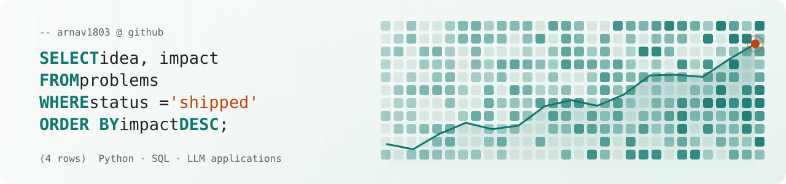

<picture>
  <source media="(prefers-color-scheme: dark)" srcset="assets/header-dark.svg"/>
  <source media="(prefers-color-scheme: light)" srcset="assets/header-light.svg"/>
  
</picture>

<h1 align="center">Arnav Sharma</h1>

<p align="center"><em>I write the query, build the service behind it, and ship it.</em></p>

<p align="center">
<a href="https://arnav-sharma.vercel.app"></a>
<a href="https://linkedin.com/in/arnav1806"></a>

</p>

<p align="center">
<sub>B.Tech CSE (AI & ML), UPES Dehradun &nbsp;·&nbsp; CGPA 8.33 / 10 &nbsp;·&nbsp; 2023 – 2027</sub>
</p>

I work where data meets software: Python services, SQL that answers real questions, and LLM features that hold up in production. I care about the unglamorous parts too, like tests, clean APIs and deployments that stay up.

## experience

```sql
SELECT role, company, period FROM experience ORDER BY period DESC;
```

**SpryIQ Technologies** &nbsp;·&nbsp; AI/ML Intern &nbsp;&nbsp;<sub>Jun – Sep 2026</sub><br/>
Built a runtime email-rephrasing feature for **bleezur.ai** that rewrites sales pitches and company introductions to suit the recipient's personality type, triggered from the Blee Copilot side panel. Built a **LangGraph agent** that lets users search, manage and add B2B target accounts through conversation.

**Allin Info Systems** &nbsp;·&nbsp; Software Development Intern &nbsp;&nbsp;<sub>Jun – Jul 2025</sub><br/>
Worked on an internal HRMS backed by MySQL, used by 100+ employees.

## projects

```sql
SELECT name, what_it_does, built_with FROM projects WHERE is_public ORDER BY relevance;
```

| name | what it does | built with |
|---|---|---|
| **[Duolingo clone](https://github.com/arnav1803/duolingo-clone)**<br/><sub>[live](https://duolingo-clone-topaz-alpha.vercel.app) · [api](https://duolingo-clone-api.vercel.app/docs)</sub> | Language-learning app with 4 courses. The backend owns every rule (XP, hearts, streaks, unlocks) and checks every answer, with **267 automated tests**. | `Python` `FastAPI` `SQLAlchemy` `SQLite` `pytest` |
| **[Agentic Fact-Checker](https://github.com/arnav1803/agentic-fact-checker)**<br/><sub>[live](https://agentic-fact-checker.vercel.app)</sub> | Splits a news article into verifiable claims, gathers web evidence and scores each claim, streaming results as they arrive. IBM internship project. | `Python` `FastAPI` `LangChain` `Groq` `MongoDB` |
| **[Finance Follow-Up Agent](https://github.com/arnav1803/Finance_FollowUp_Agent)** | Drafts follow-up emails for overdue invoices with a 4-stage tone escalation, prompt-injection guards and a SQLite audit trail, run from a dashboard. | `Python` `OpenAI` `SQLite` `Streamlit` |
| **[TMDb movie analysis](https://github.com/arnav1803/Data-Analysis)** | Exploratory analysis of 10,000 movies: how budget, genre and runtime relate to popularity and revenue. | `Python` `pandas` `Jupyter` |
| **[Real-Time ASL Detection](https://github.com/arnav1803/Real-Time-ASL-Detection)** | Reads the ASL alphabet from a webcam feed. MobileNetV2 transfer learning, **99.97%** test accuracy. | `TensorFlow` `Keras` `OpenCV` |
| **[SpeakGenie](https://github.com/arnav1803/Voice-Tutor)**<br/><sub>[live](https://voice-tutor.vercel.app)</sub> | Real-time voice tutor for children in 6 languages, with roleplay scenarios. | `Flask` `Socket.IO` `Gemini` `Google Cloud Speech` |

## stack

```sql
SELECT tool FROM toolbox WHERE used_in_production OR used_in_projects;
```

<p>

</p>

`SQLAlchemy` `pandas` `Streamlit` `LangChain` `LangGraph` `RAG` `FAISS` `Hugging Face` `LoRA / PEFT` `pytest`

## activity


## recognition

- **Winner**, ICPC Codesprint (UPES ACM)
- **IBM AI Engineering Professional Certificate**: LLM applications, RAG, prompt engineering and LLMOps
- **PR & Sponsorship Head**, IEEE SPS UPES: led the chapter launch event, 100+ participants
- **Technical & PR team**, ACM & ACM-W UPES: PR representative for Protorush, run with Dell Technologies

---

<p align="center">
<sub>Open to data, backend and applied-AI roles.</sub><br/>

</p>
